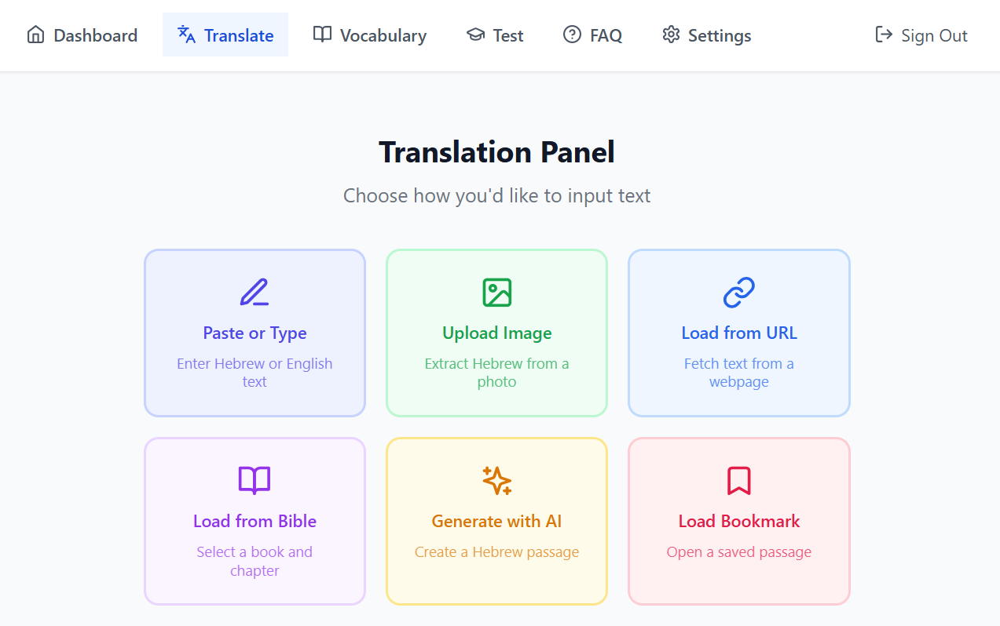
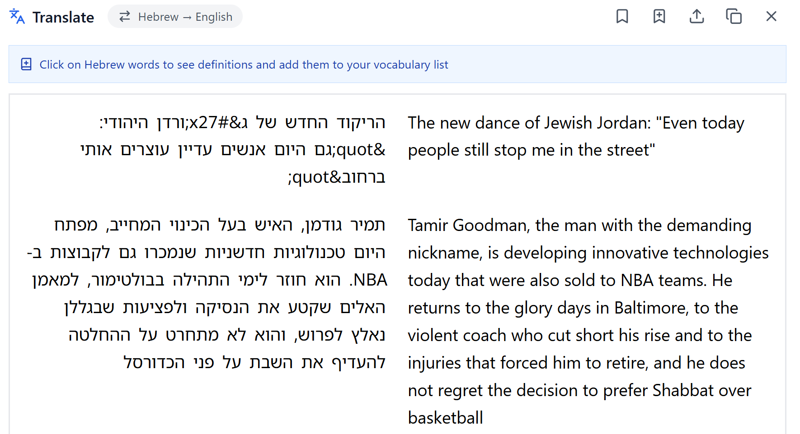
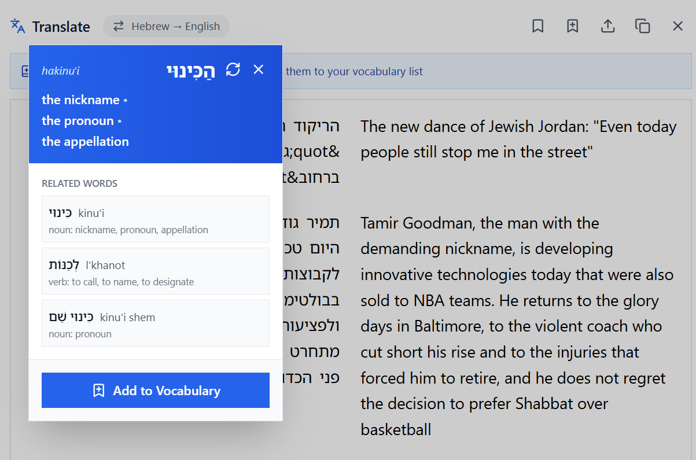
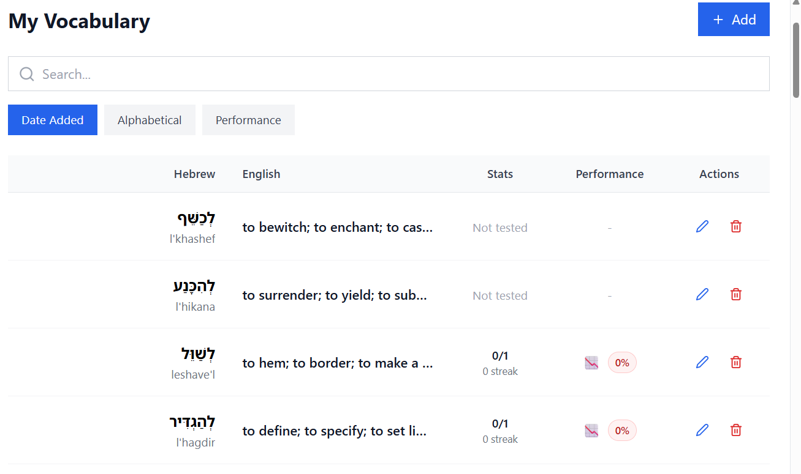
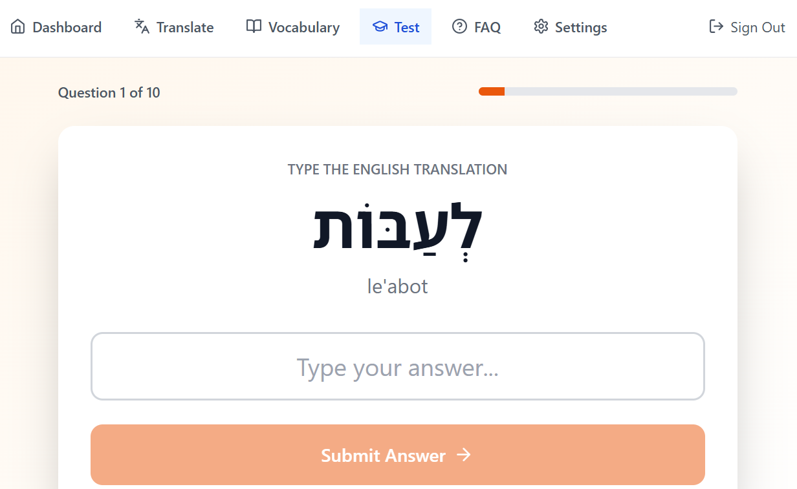

# Learn Ivrit (לימוד עברית) — Hebrew Language Learning App

A Hebrew language learning application that translates Hebrew text, lets users explore word meanings, and builds adaptive vocabulary tests.

🔗 **Live demo:** https://learn-ivrit.lovable.app/

## Why I Built This

I originally built Learn-Ivrit to automate a Hebrew learning workflow I had been doing manually: 
translating passages, looking up word definitions, maintaining vocabulary lists, 
then testing and re-testing my knowledge. 
The project evolved into a full application that combines translation, vocabulary tracking, 
and adaptive testing into a single system.

## 30-Second Overview

1. Translate Hebrew text from pasted input, uploaded images (OCR), webpage extraction, or passages generated with AI.
2. Click any Hebrew word to view its definition, transliteration, and related forms, and add it to your vocabulary list.
3. Practice vocabulary using flashcards, multiple choice, or fill-in-the-blank quizzes.
4. The system prioritizes words you struggle with to reinforce learning over time.

Create an account to save vocabulary and track progress. 
A `Guest` mode is also available, but vocabulary cannot be saved between sessions.

## Features

### Translation Panel

Translate Hebrew text from a variety of sources:

- **Paste or Type** — Enter Hebrew or English text directly
- **Upload Image** — Extract Hebrew text from a photo using OCR
- **Load from URL** — Fetch Hebrew content from any webpage
- **Load from Bible** — Select a book and chapter from the Tanakh via the Sefaria API
- **Generate with AI** — Create a Hebrew passage at your proficiency level using Gemini AI

### Bookmarks

Save and organize translated passages into bookmark folders for easy retrieval.

### Word Definitions & Vocabulary

Click any Hebrew word to see its definition, transliteration, vowelized form, and related word forms. Add words to your personal vocabulary list with a single click.

### Vocabulary Testing

Test yourself with three modes:

- **Multiple Choice** — Pick the correct translation from options
- **Fill in the Blank** — Type the English translation
- **Flashcards** — Flip cards to review words

An adaptive algorithm prioritizes words you struggle with and tracks your progress over time.

### Additional Pages

- **Dashboard** — View learning statistics and progress charts
- **Settings** — Manage account and preferences
- **FAQ, Contact, Privacy Policy, Terms of Service**

## Screenshots

### Translation Panel






### Vocabulary List



### Vocabulary Testing


---

## Project Structure

```
src/
├── components/          # UI components (feature-based folders)
│   ├── Dashboard/
│   ├── TranslationPanel/
│   ├── VocabularyList/
│   ├── TestPanel/
│   ├── Navigation/
│   ├── Footer/
│   ├── Settings/
│   └── ui/              # shadcn/ui primitives
├── contexts/            # React context providers (Auth)
├── hooks/               # Shared hooks (bookmarks, toast, etc.)
├── utils/               # Utility modules
├── pages/               # Route-level page components
├── data/                # Static data (Bible books, default vocab)
└── integrations/        # Supabase client & generated types

supabase/
├── functions/           # Edge Functions (Gemini, Sefaria, email)
└── config.toml          # Supabase local config
```

Each feature folder follows the pattern:

- `Component.tsx` — Container (connects hook to UI)
- `ComponentUI.tsx` — Presentational component
- `useComponent.ts` — Custom hook (state & logic)
- `componentUtils.ts` — Pure utility functions
- `*.unittest.ts(x)` — Unit tests

---

## CI/CD Pipeline

The project uses a multi-branch promotion strategy with GitHub Actions:

```
development → integration → ui → main
```

Each branch runs progressively more checks before auto-promoting to the next:

| Description     | Workflow File     | Trigger                  | Checks                                                  |
| --------------- | ----------------- | ------------------------ |---------------------------------------------------------|
| **Base Checks** | `base-checks.yml` | Called by others         | Build, ESlint, TypeScript type checking, basic security |
| **Development** | `development.yml` | Push/PR to `development` | Base checks → Unit tests → Promote to `integration`     |
| **Integration** | `integration.yml` | Push to `integration`    | Development checks → Promote to `ui`                    |
| **UI**          | `ui.yml`          | Push to `ui`             | Integration checks → Promote to `main`                  |
| **Security**    | `security.yml`    | Called by Production     | npm audit, Trivy scan, license check                    |
| **Production**  | `main.yml`        | Push to `main`           | UI checks + Security audit                              |

All workflow files are in `.github/workflows/`.

Planned additions: integration, UI, and E2E tests.

---

## Commands

### Build

```bash
npm run build:prod       # TypeScript check + production build
npm run build:dev        # Development build (no type checking, no minification)
```

### Deploy

```bash
npm run deploy:dev       # Start dev server with hot reload (HMR)
npm run deploy:prod      # Serve production build locally
```

### Testing

```bash
npm run test             # Run all tests (unit + integration + ui (not all implemented yet))
npm run test:unit        # Run only unit tests
npm run test:watch       # Run all tests in watch mode
```

### Code Quality

```bash
npm run lint             # Run ESLint
npm run typecheck        # TypeScript type checking (no emit)
```

### Security

```bash
npm run security:base    # npm audit + audit-ci (moderate level)
npm run security:audit   # Custom deep dependency audit script
```

---

## Tech Stack

- **Frontend** — React 18, TypeScript, Vite
- **Styling** — Tailwind CSS, shadcn/ui
- **Backend** — Supabase (Auth, PostgreSQL, Edge Functions)
- **AI** — Google Gemini API (translation, definitions, passage generation)
- **External APIs** — Sefaria (Biblical texts)
- **Email** — Resend
- **Testing** — Vitest, React Testing Library
- **CI/CD** — GitHub Actions

---

## Getting Started

```bash
# Clone the repository
git clone https://github.com/bmmoskow/learn-ivrit.git
cd learn-ivrit

# Install dependencies
npm install

# Start the development server
npm run deploy:dev
```

The app requires a Supabase project with the appropriate tables and Edge Functions deployed. See `supabase/` for configuration.
